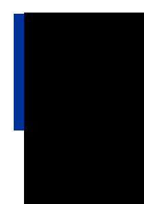
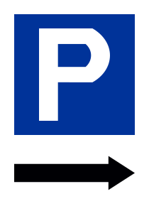
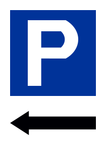

Vector graphic projects
===

&copy; 2018 Rafał Krupiński

Golden Compass Rose
---

Sun Envisioned
---

Parking
---

The P signs are in A4 size with 2cm margins.
The first one requiers non-commercial freeware font Drogowskaz (source for the other two). Why browsers don't show it with some default font?

